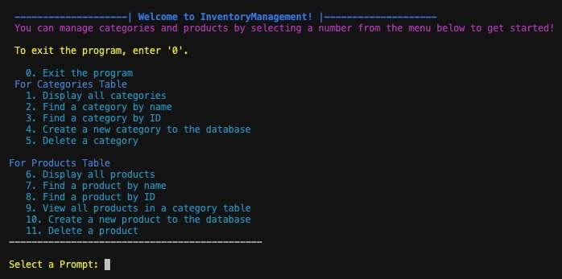

# InventoryManagement!

The InventoryManagement! project is a command-line interface (CLI) built with Python. It focuses on managing inventories of products categorized under various categories in an SQLite database. This application leverages Object-Relational Mapping (ORM) to convert data from Python into SQL for interaction with the database. Additionally, it uses SQLite, a software library that provides a database system for Python to connect to an SQL database.

This application is designed to allow users to perform several operations, including creating a record, displaying all data, finding a specific record, and deleting an existing record on categories and products.

InventoryManagement! is helpful for anyone who needs to manage an inventory of products, such as in a warehouse or retail setting. It allows users to easily track their inventory and ensure all products are correctly categorized and accounted for.

## Features

- **Categories:** The categories table in the database has ID and name attributes.
  - **Manage Categories:** A user can create a new category, retrieve all categories, find a category by name or ID, and delete a category.
- **Products:** The products table in the database includes columns of ID, name, price, description, quantity in stock, sub-category, and category's ID.

  - **Manage Categories:** A user can create a new product, retrieve all products, find a product by name or ID, and delete a product.

- **View All Products in Category:** A user can view all products linked with a specific category. This will make it easier for the user to see all items within a particular category.

- **Select an Option in Menu:** An interactive menu displays options for the user to select a number corresponding to the operation that one wants to act to receive the result until one chooses to exit.

- **Error Handling:** This application has informative errors to display clear error messages to the user when an action fails.

## Dependencies in Project
- colorama: This is used to colorize text.
- texttable: This is used to display structured tables.
- faker
- pytest
- ipdb

## Requirements for Installation
- Python version: 3.8.13
- Pip 
- SQLite3

## How to Get Started

1. Open your terminal
2. Fork and clone the repository:
   ```
   git clone https://github.com/brendenwest/lostappleproject.git
   ```
3. Run the command to install the packages and create a virtual environment in your terminal:
   ```
   pipenv install
   ```
4. Run the command to activate the virtual environment:
   ```
   pipenv shell
   ```
5. Run the command to initialize a database with data of categories and products. This command is to execute a Python script located at lib/seed.py:
   ```
   python3 lib/seed.py
   ```

## How to Use the App

1. Run the command to start the app:
   ```
   python3 lib/cli.py
   ```
2. You will see the options of action that you can choose to select from the menu.
   
   
   
   The option you choose will display the output of the results.

4. If there are changes in the database like deleting, creating, or any other changes, you can run the command to get the original database again:
   ```
   python3 lib/seed.py
   ```

## Contributing

Contributions are welcome! If you have suggestions, make an improvement, or encounter a bug, please open an issue. If you want to contribute code, please fork the repository and submit a pull request.
